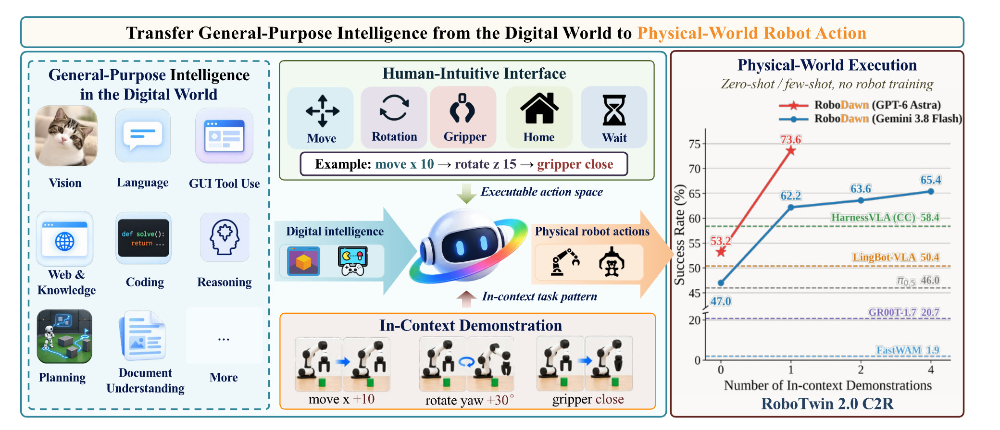
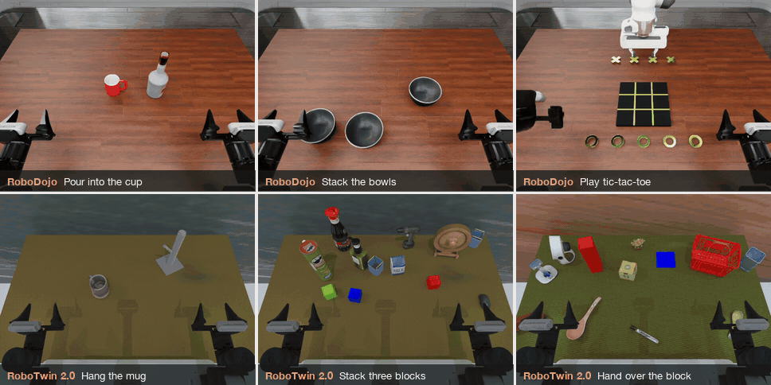
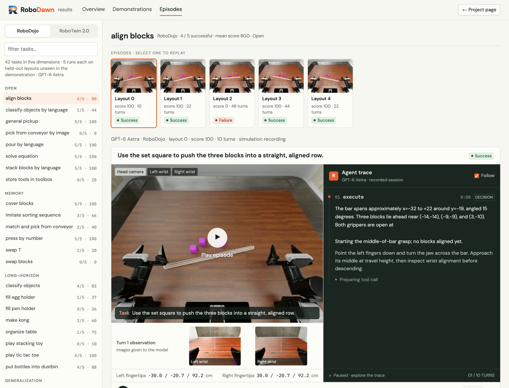
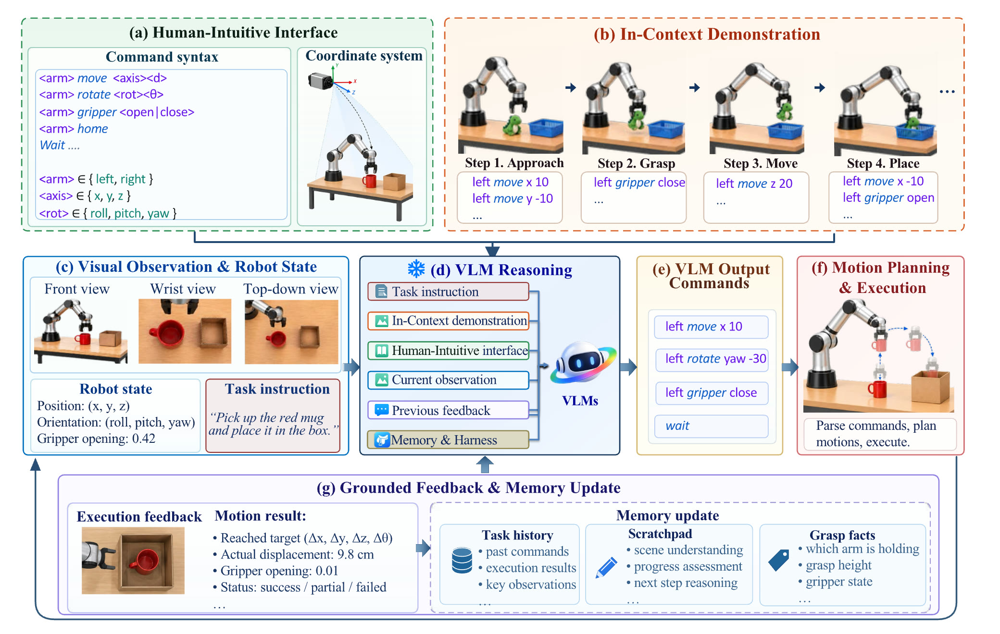
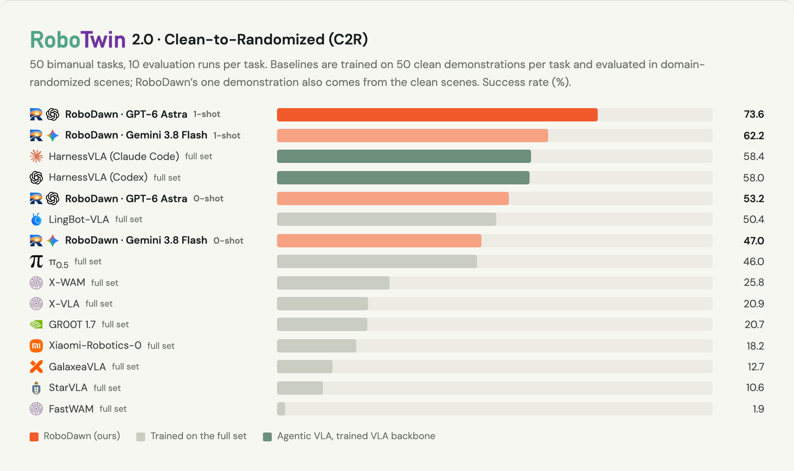
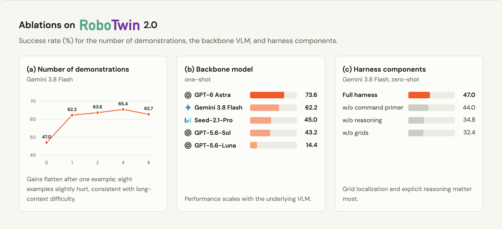
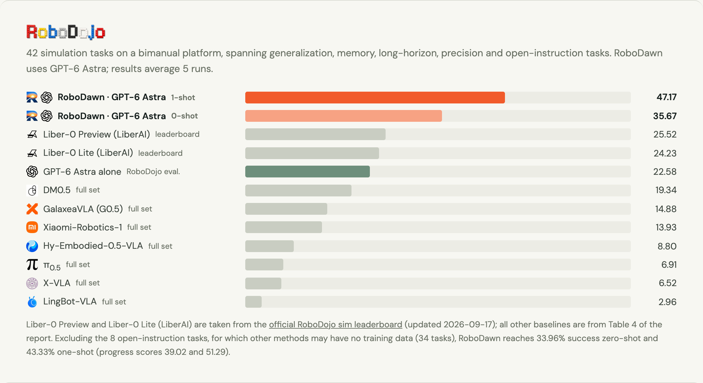
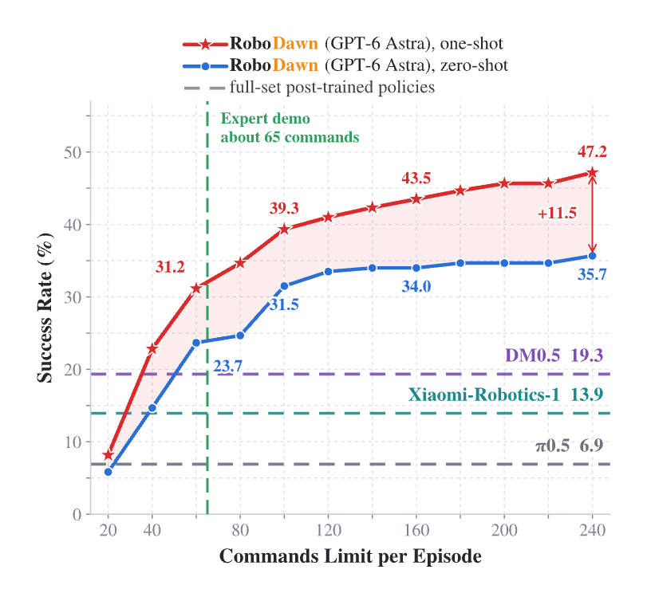

<p align="center">
  
</p>

<h1 align="center">Transferring the Intelligence of VLMs to Robotic Control</h1>

<p align="center">
  <b>RoboDawn</b>: a frozen vision-language model drives a robot through a handful of<br>
  human-intuitive commands (move, rotate, grip) and learns a task from one demonstration in context.<br>
  <b>No task-specific robot training.</b>
</p>

<p align="center">
  Meng-Hao Guo<sup>1</sup> · Zhe-Han Mo<sup>1</sup> · Jia-Jun Wang<sup>1</sup> · Yi Zhang<sup>1</sup> · Kejin Wang<sup>1</sup> · Yi-Xuan Deng<sup>1</sup> · Jia-Peng Zhang<sup>1</sup> · Yongming Rao<sup>2</sup> · Shi-Min Hu<sup>1,*</sup><br>
  <sup>1</sup>Tsinghua University &nbsp; <sup>2</sup>Tencent Hunyuan &nbsp; <sup>*</sup>Corresponding author
</p>

<p align="center">
  <a href="https://arxiv.org/abs/2609.22966"></a>
  <a href="https://robodawn.top"></a>
  <a href="https://robodawn.top/results"></a>
  <a href="LICENSE"></a>
</p>

<p align="center">
  
</p>

## Highlights

<table>
  <tr>
    <td align="center" width="25%"><h3>73.6%</h3>RoboTwin 2.0 C2R<br>one demonstration<br><sub>GPT-6 Astra</sub></td>
    <td align="center" width="25%"><h3>53.2%</h3>RoboTwin 2.0 C2R<br>zero-shot<br><sub>π0.5 trained on the full set: 46.0%</sub></td>
    <td align="center" width="25%"><h3>47.17%</h3>RoboDojo success<br>one demonstration<br><sub>35.67% zero-shot · DM0.5: 19.34%</sub></td>
    <td align="center" width="25%"><h3>9 / 10</h3>Real Franka<br>block in basket<br><sub>zero-shot, Gemini 3.8 Flash</sub></td>
  </tr>
</table>

- **A human-intuitive interface.** Every turn the model sees the camera images and the robot state and replies with a few commands such as `left move z -5`, `right point down` or `left gripper close`. Each command runs as one complete planned motion, and the model sees the result.
- **In-context learning.** One expert demonstration of the task in the context lifts RoboTwin 2.0 from 53.2% to 73.6% and RoboDojo from 35.67% to 47.17%, above policies post-trained on the whole benchmark.
- **Everything open.** Code, prompts, the 128 in-context demonstrations, the evaluation seeds, and all 710 evaluation episodes, failures included, replayable turn by turn at [robodawn.top/results](https://robodawn.top/results).

## News

- **2026-09-22** Code, prompts, demonstrations and evaluation seeds released.
- **2026-09-19** Paper on arXiv: [2609.22966](https://arxiv.org/abs/2609.22966).

## Episodes

<p align="center">
  
</p>

Every evaluation episode behind the paper's numbers is online at
**[robodawn.top/results](https://robodawn.top/results)**: 500 RoboTwin 2.0 and
210 RoboDojo episodes, failures included, together with the 128 in-context
demonstrations they were run with. Each one replays turn by turn: the images
the model saw, the plan it wrote, the commands it issued and the execution
feedback it got back.

<p align="center">
  <a href="https://robodawn.top/results"></a>
</p>

## How it works

<p align="center">
  
</p>

A multimodal LLM controls the robot in closed loop through a tiny discrete
command grammar (a). One expert demonstration of the task is placed in the
context (b). Every turn the model receives the camera views, the robot state
and the instruction (c), reasons over them together with the previous
feedback and its memory (d), and replies with a few commands (e). Each command
becomes one planned motion (f), and the execution feedback and memory update
go into the next turn (g).

```text
<arm> move <x|y|z> <cm>          <arm> rotate <roll|pitch|yaw> <deg>
<arm> point down|forward|...     <arm> gripper open|close
<arm> home      wait      done   (<arm> is left or right; world frame)
```

This repository contains the code, prompts, in-context demonstrations and
evaluation seeds behind the paper's results on two bimanual manipulation
benchmarks, [RoboTwin 2.0](https://github.com/RoboTwin-Platform/RoboTwin) and
[RoboDojo](https://github.com/RoboDojo-Benchmark/RoboDojo). Everything needed
to reproduce the reported numbers is in the tree or pinned as a submodule: the
harnesses, the exact demonstrations each number was measured with, the
evaluation seeds / layouts, and the benchmark commits.

## Results

### RoboTwin 2.0

<p align="center">
  
</p>

<p align="center">
  
</p>

<details>
<summary><b>Tables: the runs of this repository, the published baselines, the ablations</b></summary>

The runs of this repository, one task demonstration in context.
50 tasks x 10 episodes on the seeds in `harness/valid_seeds/` (`demo_randomized`
scenes), 45 turns per episode, model reasoning on, the command primer in every
context, followed by the task's expert demonstration from `demos/robotwin2/expert`
(chosen by grasp side). Every episode counts in N: the one gemini-3.8-flash
episode whose endpoint never answered (`finished_reason` `parse_failure`) is a
failure. The 95% interval is computed from the per-task binomial variance.

| Model | Success / N | Success rate | 95% CI |
| --- | --- | --- | --- |
| gpt-6-astra | 368 / 500 | **73.6%** | ±3.1 |
| gemini-3.8-flash | 311 / 500 | 62.2% | ±3.5 |
| Doubao-Seed-2.1-pro | 225 / 500 | 45.0% | ±3.4 |
| gpt-5.6-sol | 216 / 500 | 43.2% | ±3.4 |
| gpt-5.6-luna | 72 / 500 | 14.4% | ±2.3 |

Against the published baselines (Table 1 of the paper). "Full set" is the
official C2R protocol: one policy post-trained on all 50 tasks with 50 clean
demonstrations each, evaluated in the same domain-randomized scenes.
RoboDawn updates no parameters and sees at most one demonstration, in context.
Its zero-shot rows keep the command primer and drop the task demonstration;
they are reported numbers, not a configuration this repository ships.

| Method | Robot training | Shots | Success rate |
| --- | --- | --- | --- |
| **RoboDawn (GPT-6 Astra)** | none | 1 | **73.6%** |
| **RoboDawn (Gemini 3.8 Flash)** | none | 1 | 62.2% |
| HarnessVLA (Claude Code) | full set | — | 58.4% |
| HarnessVLA (Codex) | full set | — | 58.0% |
| **RoboDawn (GPT-6 Astra)** | none | 0 | 53.2% |
| LingBot-VLA | full set | — | 50.4% |
| **RoboDawn (Gemini 3.8 Flash)** | none | 0 | 47.0% |
| π0.5 | full set | — | 46.0% |
| X-WAM | full set | — | 25.8% |
| X-VLA | full set | — | 20.9% |
| GR00T 1.7 | full set | — | 20.7% |
| Xiaomi-Robotics-0 | full set | — | 18.2% |
| GalaxeaVLA | full set | — | 12.7% |
| StarVLA | full set | — | 10.6% |
| FastWAM | full set | — | 1.9% |

Ablations (Table 3 of the paper). Number of demonstrations in context, with
Gemini 3.8 Flash:

| Demonstrations | 0 | 1 | 2 | 4 | 8 |
| --- | --- | --- | --- | --- | --- |
| Success rate | 47.0% | 62.2% | 63.6% | 65.4% | 62.7% |

Harness components, with Gemini 3.8 Flash, zero-shot:

| Harness | full | w/o command primer | w/o reasoning | w/o grid localization |
| --- | --- | --- | --- | --- |
| Success rate | 47.0% | 44.0% | 34.8% | 32.4% |

</details>

### RoboDojo

<p align="center">
  
</p>

<p align="center"><sub>Success rate (%) over the 42 RoboDojo tasks.</sub></p>

<p align="center">Test-time scaling: success keeps rising with the per-episode command budget (Fig. 3 of the paper).</p>

<p align="center">
  
</p>

<details>
<summary><b>Tables: the five dimensions, the published baselines, test-time scaling</b></summary>

gpt-6-astra, seed 0, the five fixed evaluation layouts of every task (layouts
0-4; when RoboDojo classifies a layout as unstable its runner substitutes the
next one, which happened for layout 4 of `imitate_sorting_sequence`), one
expert demonstration from `demos/robodojo` in context. Success rate and score
are RoboDojo's native metrics, aggregated as RoboDojo's own summary does: mean
over the tasks of a dimension, then the unweighted mean over the dimensions.
"Without Open" is the mean over the other four dimensions (the 34-task setting
of the paper: the post-trained baselines have no training data for the 8 Open
tasks). The per-task numbers, and the MD5 of each task's demonstration, are in
[`demos/robodojo/MANIFEST.json`](demos/robodojo/MANIFEST.json).

| Dimension | Tasks | Success rate | Score |
| --- | --- | --- | --- |
| Open | 8 | 62.50% | 68.00 |
| Memory | 6 | 53.33% | 54.33 |
| Long-Horizon | 8 | 45.00% | 59.88 |
| Generalization | 12 | 50.00% | 55.08 |
| Precision | 8 | 25.00% | 35.88 |
| **Mean over the five dimensions** | 42 | **47.17%** | **54.63** |
| Without Open | 34 | 43.33% | 51.29 |

Against the published baselines (Table 4 of the paper; "full set" is one
policy post-trained on the whole RoboDojo training set). As on RoboTwin, the
zero-shot rows are the same evaluation without the task demonstration in
context; the shipped configuration is the one-shot one.

| Method | Robot training | Shots | Score | Success rate |
| --- | --- | --- | --- | --- |
| **RoboDawn (GPT-6 Astra)** | none | 1 | **54.63** | **47.17%** |
| **RoboDawn (GPT-6 Astra)** | none | 0 | 39.92 | 35.67% |
| Liber-0 Preview (LiberAI) | leaderboard | — | 30.74 | 25.52% |
| Liber-0 Lite (LiberAI) | leaderboard | — | 29.24 | 24.23% |
| GPT-6 Astra on RoboDojo's own eval | none | 0 | 28.97 | 22.58% |
| DM0.5 | full set | — | 24.90 | 19.34% |
| GalaxeaVLA (G0.5) | full set | — | 20.23 | 14.88% |
| Xiaomi-Robotics-1 | full set | — | 20.07 | 13.93% |
| Hy-Embodied-0.5-VLA | full set | — | 13.07 | 8.80% |
| π0.5 | full set | — | 11.41 | 6.91% |
| X-VLA | full set | — | 10.13 | 6.52% |
| LingBot-VLA | full set | — | 5.50 | 2.96% |

On the 34-task setting (without the 8 Open tasks) RoboDawn reaches 43.33%
success one-shot and 33.96% zero-shot (scores 51.29 and 39.02). The two
Liber-0 rows are from the
[official RoboDojo leaderboard](https://robodojo-benchmark.com/leaderboard)
as of 2026-09-17; the other baselines are Table 4 of the paper.

Test-time scaling (Fig. 3 of the paper): success keeps rising with the
per-episode interaction budget, the `--max-decisions` of
`scripts/robodojo/run_vlm_experiment.py`, whose default 240 is the reported
configuration.

| Budget per episode | 60 | 240 |
| --- | --- | --- |
| One demonstration | 31.2% | 47.2% |
| Zero-shot | 23.7% | 35.7% |

</details>

### Real robots

The same harness on physical robots with Gemini 3.8 Flash, zero-shot: no
task-specific training and no task demonstration in context (Table 5 of the
paper). This repository ships the real-robot skeleton only
(`harness/examples/`, `--mock` dry run), not the lab setups.

| Task | Robot | Successful trials |
| --- | --- | --- |
| Block in basket | Franka | 9 / 10 |
| Block stacking | Franka | 5 / 10 |
| Cloth folding | Piper | 0 / 10 |

<details>
<summary><b>Inference and execution time</b></summary>

Per decision, averaged over the 50 RoboTwin 2.0 tasks, with Seed-2.1-Pro as
RoboDawn's model (Table 2 of the paper). The inference-to-motion ratio says
how much thinking time surrounds each unit of robot motion; below 0.5,
inference could be overlapped with motion for streaming execution.

| Model | Inference | Actions | Motion time | Inference / motion |
| --- | --- | --- | --- | --- |
| π0.5 | 101 ms | 45.0 steps | 2.70 s | 0.037 |
| StarVLA | 70 ms | 16.0 steps | 0.96 s | 0.073 |
| X-VLA | 143 ms | 28.6 steps | 1.71 s | 0.084 |
| FastWAM | 523 ms | 27.3 steps | 1.64 s | 0.32 |
| Motus | 1.93 s | 16.0 steps | 0.96 s | 2.01 |
| LingBot-VA | 8.89 s | 22.2 steps | 1.33 s | 6.67 |
| **RoboDawn (Seed-2.1-Pro)** | 9.74 s | 3.4 commands | 2.09 s | 4.65 |

</details>

## Repository layout

```
harness/                       RoboTwin 2.0 harness
├── core/                      command grammar, environment interface, watchdog
├── agent/                     LLM client, prompts, memory, demonstration loader, control loop
├── robotwin/                  RoboTwin 2.0 behind the discrete interface (official protocol, cameras, overlays)
├── configs/                   robot profile (prompt facts), task list, real-robot profile template
├── examples/                  real-robot skeleton (--mock dry run)
├── valid_seeds/               expert-validated evaluation seeds, one file per task and scene config
├── run_robotwin_eval.py       evaluation entry point
└── scripts/aggregate_results.py  per-task and overall success rate of a run directory
evaluation/policies/vlm_agent/ RoboDojo policy (XPolicyLab policy server + Isaac Sim client side)
scripts/robodojo/              RoboDojo setup, launch and experiment scripts
demos/                         the in-context demonstrations (see demos/README.md)
├── robotwin2/expert           one or two expert demonstrations per RoboTwin task
├── robotwin2/primer           the task-independent command primer
└── robodojo/                  one expert demonstration per RoboDojo task, with MANIFEST.json
RoboTwin/                      submodule: official RoboTwin 2.0 at the evaluated commit
RoboDojo/                      submodule: official RoboDojo at the evaluated commit
tests/                         offline tests (no simulator, no model calls)
```

## Setup

```bash
git clone --recurse-submodules https://github.com/Hugo-AGI/RoboDawn.git
cd RoboDawn
```

Model access is an OpenAI-compatible chat-completions endpoint. Reasoning must
be switched on: the client sends the per-family fields in
`harness/agent/llm_client.py::THINKING_EXTRA`; check
`usage.completion_tokens_details.reasoning_tokens` in `llm_calls.jsonl` after
a first episode to confirm your endpoint actually reasons.

### RoboTwin 2.0

1. Install the pinned `RoboTwin/` submodule following its own README (conda
   environment `RoboTwin` with SAPIEN and cuRobo) and download its assets. Do
   not modify the submodule; the harness only imports it. `ROBOTWIN_ROOT` can
   point at another official checkout of the same commit.
2. Put the API key in a file, e.g. `~/.config/robodawn/key` (one key per line;
   several keys are spread over processes), or export `LLM_API_KEY`. The
   endpoint is `--api_base` or `LLM_API_BASE`.
3. `harness/valid_seeds/` decides the scene of every episode and must be used
   as shipped: every reported number was measured on these seeds.

### RoboDojo

1. Install the pinned `RoboDojo/` submodule following its documentation
   (Isaac Sim 5.1, conda environment `RoboDojo`) and download its assets.
2. Create the policy environment and link the policy into RoboDojo:

   ```bash
   conda create -n vlm_policy python=3.11 -y && conda activate vlm_policy
   pip install "numpy>=1.23,<2" "pyyaml>=6" "opencv-python-headless>=4.8" "h5py>=3.8" \
       "websockets>=14" "msgpack>=1.0.8" "msgpack-numpy>=0.4.8" "pydantic>=2.5" "pillow>=10" \
       -r evaluation/policies/vlm_agent/requirements.txt
   bash scripts/robodojo/setup_vlm_policy.sh
   ```

   `setup_vlm_policy.sh` also re-renders the robot configs of the asset bundle
   for this machine (`scripts/robodojo/fix_asset_paths.sh`); run it again after
   re-downloading assets. If Isaac Sim fails to start on the URDF importer
   extension pin, `scripts/robodojo/patch_isaaclab_urdf_pin.sh` relaxes it;
   on NVIDIA 595 drivers run `python3 scripts/robodojo/compat/vulkan_driver_compat.py --prepare` once.
3. Copy `secrets.example.json` to `secrets.json` and fill in one profile per
   model (`name`, `model`, `base_url`, `api_key`).

## Reproducing the RoboTwin 2.0 results

One task, ten episodes (the defaults are the reported configuration):

```bash
conda activate RoboTwin
CUDA_VISIBLE_DEVICES=0 PYTHONPATH=$PWD python harness/run_robotwin_eval.py \
    --task place_empty_cup --episodes 10 --model gpt-6-astra \
    --api_base https://<endpoint>/v1 --api_key_file ~/.config/robodawn/key \
    --output results/rt2/gpt-6-astra/place_empty_cup/shard_0
```

Runs are resumable (finished episodes in `--output` are skipped). The task
names are in `harness/configs/robotwin2_all_tasks.txt`; the aggregate table of
a run directory:

```bash
python harness/scripts/aggregate_results.py results/rt2
```

Each episode takes 10-30 minutes of wall clock; three processes fit on one
24 GB GPU. A request carries up to 58 images (6 primer + 4 current turn + up
to 48 demonstration frames); make sure the endpoint accepts that many.

## Reproducing the RoboDojo results

One task, all five layouts (the defaults are the reported configuration:
240 turns, 8000 reply tokens, `reasoning_effort: high`, the shipped
demonstration bank):

```bash
python scripts/robodojo/run_vlm_experiment.py run --experiment-dir experiments/robodojo \
    --run-id gpt6_stack_bowls --model gpt-6-astra --task stack_bowls --gpu 0
python scripts/robodojo/run_vlm_experiment.py summary --experiment-dir experiments/robodojo
```

`--model` names a profile in `secrets.json`. The run directory holds the
launch manifest, the per-turn decision logs
(prompt, images, reply, execution report) and `summary.json`; RoboDojo's own
`_result.json` with `success_rate` and `score` is written under
`RoboDojo/eval_result/`. `summary` folds all runs into `results.csv`.
Dimension averages follow RoboDojo's task grouping (Open, Memory,
Long-Horizon, Generalization, Precision).

`bash scripts/robodojo/run_vlm_eval.sh --task stack_bowls` runs the same
configuration directly through RoboDojo's `robodojo.sh eval` without the
experiment bookkeeping.

## Documentation

* [harness/README.md](harness/README.md): the RoboTwin harness, the command
  grammar, the design points, and how to put the controller on another robot.
* [evaluation/policies/vlm_agent/README.md](evaluation/policies/vlm_agent/README.md):
  the RoboDojo policy, its configuration and execution details.
* [demos/README.md](demos/README.md): the demonstration banks, their format
  and provenance, and the per-task RoboDojo results.

## Citation

If you find RoboDawn useful, please cite:

```bibtex
@article{guo2026robodawn,
  title   = {Transferring the Intelligence of VLMs to Robotic Control},
  author  = {Guo, Meng-Hao and Mo, Zhe-Han and Wang, Jia-Jun and
             Zhang, Yi and Wang, Kejin and Deng, Yi-Xuan and
             Zhang, Jia-Peng and Rao, Yongming and Hu, Shi-Min},
  journal = {arXiv preprint arXiv:2609.22966},
  year    = {2026}
}
```

## Acknowledgements

RoboDawn started from [dexbotic-benchmark](https://github.com/Dexmal/dexbotic-benchmark)
(Dexmal, MIT license), whose evaluation scaffolding for RoboTwin 2.0 and
RoboDojo we built on. The benchmarks themselves are
[RoboTwin 2.0](https://github.com/RoboTwin-Platform/RoboTwin) and
[RoboDojo](https://github.com/RoboDojo-Benchmark/RoboDojo); please cite them
when you use these results.

## License

MIT, see [LICENSE](LICENSE).
